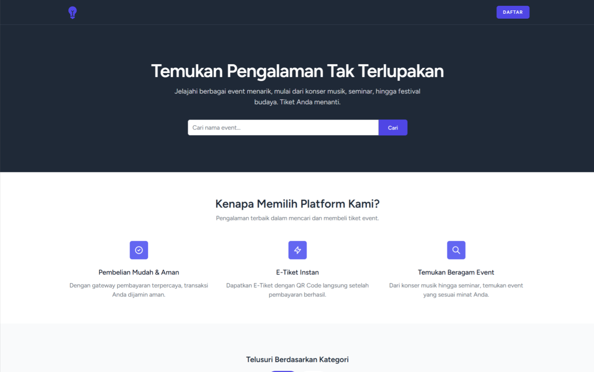
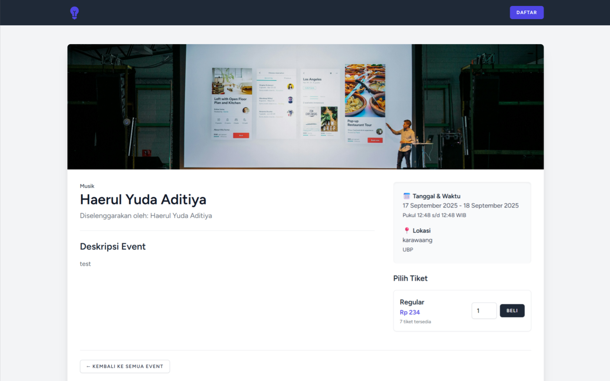
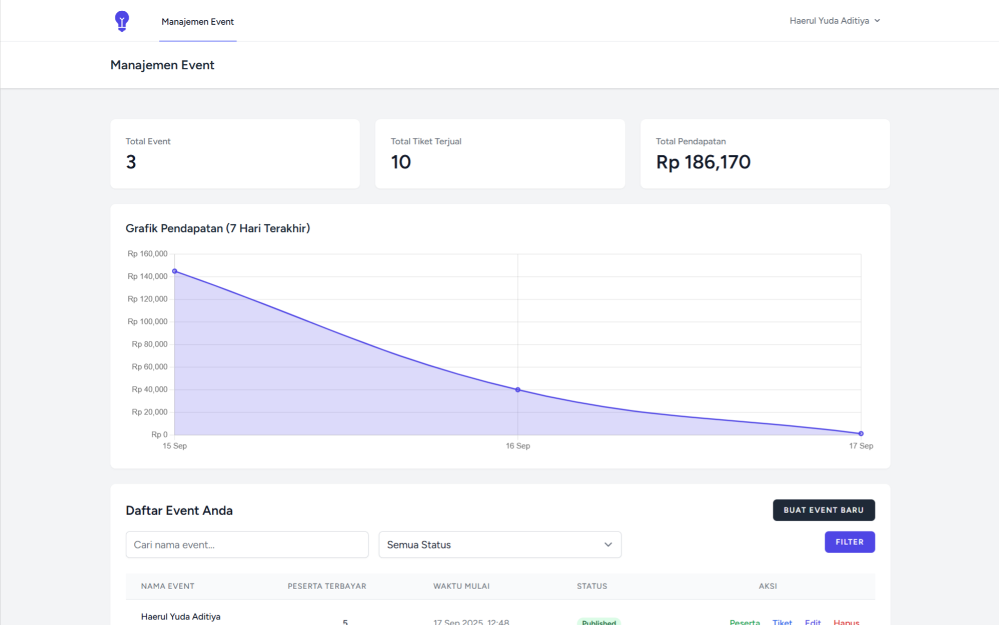
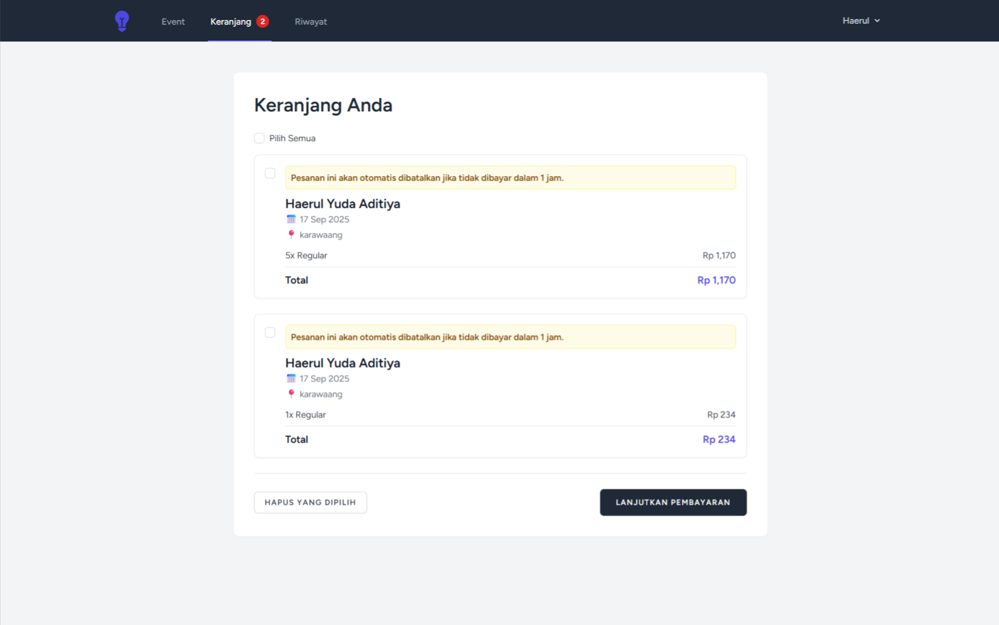
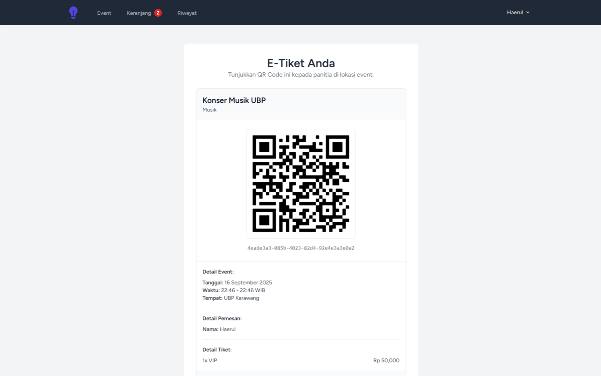
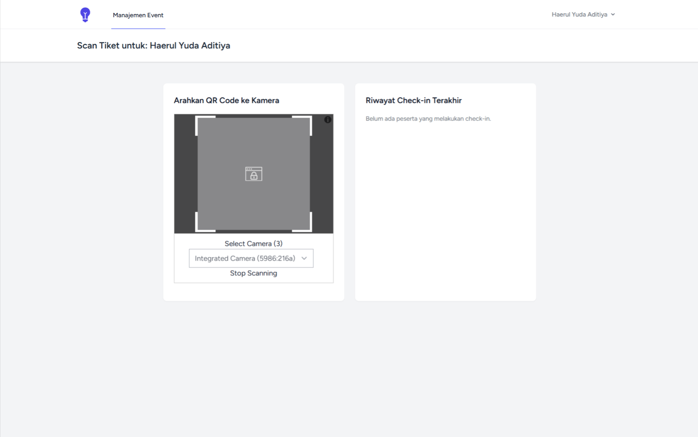

# Platform Event Laravel

Sebuah platform manajemen dan penjualan tiket event modern yang dibangun dari nol menggunakan Laravel 12. Proyek ini mencakup alur kerja lengkap mulai dari pembuatan event oleh organizer, pemesanan dan pembayaran oleh pengguna, hingga check-in peserta menggunakan QR Code.

---

## 📸 Screenshot

<p align="center">
  
  
  
  
  
  
</p>

---

## ✨ Fitur Utama

### Untuk Pengguna:
- ✅ **Pencarian & Filter**: Mencari event berdasarkan nama dan memfilter berdasarkan kategori.
- ✅ **Keranjang Multi-Item**: Memesan beberapa tiket dari event yang berbeda dalam satu alur.
- ✅ **Pembayaran Online**: Integrasi dengan Midtrans (mode Sandbox) untuk memproses pembayaran.
- ✅ **Riwayat Pesanan**: Halaman khusus untuk melihat semua riwayat transaksi dengan filter lengkap.
- ✅ **E-Tiket & QR Code**: Menerima E-Tiket dengan QR Code unik setelah pembayaran berhasil.
- ✅ **Notifikasi Email**: Menerima email konfirmasi dan verifikasi yang dikirim melalui antrian.

### Untuk Organizer:
- ✅ **Dasbor Analitik**: Melihat ringkasan total event, pendapatan, dan tiket terjual, lengkap dengan grafik penjualan 7 hari terakhir.
- ✅ **Manajemen Event**: CRUD penuh untuk event, termasuk upload gambar dan pengaturan kategori.
- ✅ **Manajemen Tiket**: CRUD penuh untuk jenis-jenis tiket di setiap event.
- ✅ **Daftar Peserta**: Melihat daftar peserta yang sudah membayar untuk setiap event.
- ✅ **Notifikasi Real-Time**: Menerima notifikasi *pop-up* instan saat ada tiket terjual.
- ✅ **Scanner QR Code**: Halaman *check-in* untuk memvalidasi tiket peserta di lokasi acara.

### Sistem & Keamanan:
- ✅ **Otentikasi Berbasis Peran**: Sistem membedakan hak akses antara Tamu, User, dan Organizer.
- ✅ **Verifikasi Email**: Pengguna baru harus memverifikasi email mereka sebelum bisa melakukan transaksi.
- ✅ **Keamanan Form**: Dilengkapi dengan Google reCAPTCHA v2 untuk mencegah pendaftaran bot.
- ✅ **Tugas Otomatis**:
    - **Queues**: Tugas yang berjalan lama (seperti mengirim email) diproses di latar belakang.
    - **Scheduler**: Pesanan yang tidak dibayar akan otomatis dibatalkan setelah 1 jam.

---

## 🚀 Teknologi yang Digunakan

- **Backend**: Laravel 12, PHP 8.2
- **Frontend**: Blade, Tailwind CSS, Alpine.js
- **Database**: MySQL
- **Real-Time**: Laravel Reverb (WebSockets)
- **Pembayaran**: Midtrans (Sandbox)
- **Antrian & Jadwal**: Laravel Queues & Scheduler dengan driver Database
- **Lainnya**: Chart.js, SweetAlert2, Laravel Excel (untuk ekspor), Simple QR Code

---

## 🛠️ Instalasi & Setup Lokal

1.  **Clone repositori:**
    ```bash
    git clone [https://github.com/haerulyudaaditiya/platform-event-laravel](https://github.com/haerulyudaaditiya/platform-event-laravel)
    cd platform-event-laravel
    ```

2.  **Install dependensi:**
    ```bash
    composer install
    npm install
    ```

3.  **Setup Environment:**
    ```bash
    cp .env.example .env
    php artisan key:generate
    ```

4.  **Konfigurasi file `.env`** Anda dengan kredensial database, Midtrans, Mail, dan reCAPTCHA.

5.  **Jalankan migrasi database:**
    ```bash
    php artisan migrate
    ```

6.  **Buat symbolic link untuk storage:**
    ```bash
    php artisan storage:link
    ```

7.  **Jalankan semua server development** (masing-masing di terminal terpisah):
    ```bash
    # Server Web
    php artisan serve

    # Compiler Aset Frontend
    npm run dev

    # Server WebSocket
    php artisan reverb:start

    # Pekerja Antrian
    php artisan queue:work

    # Penjadwal (simulasi Cron Job)
    php artisan schedule:work
    ```
---

## 🧪 Menjalankan Tes

Untuk menjalankan tes otomatis yang sudah dibuat:
```bash
php artisan test
```
